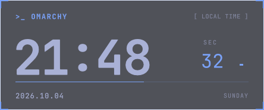

# Omarchy Desktop Clock

Omarchy 桌面时钟：等宽数字、终端标题、主题色边框、日期与星期。



- **只在每个显示器当前的空工作区显示**。有应用窗口时，该屏幕的时钟窗口被销毁；回到空工作区后恢复。
- 颜色与字体跟随 Omarchy，位置在所有显示器与工作区间共享。
- 星期使用系统语言的短名称，中文环境显示“周一”至“周日”。
- 鼠标左键拖动，空桌面上的时钟同步移动，松开后保存相对位置。
- 拖动全程使用同一个显示窗口；停住或松开不切换卡片，时钟图层关闭位移动画与淡出。
- 时钟位于壁纸上方，不保留屏幕空间，不获取键盘焦点。
- 独立的软件渲染进程负责时钟，避免占用 Wave 所在的 Omarchy 渲染线程。
- 全部工作区被占用时，没有时钟窗口，停止计时，没有轮询或常驻动画。

## 安装

需要正在运行的 Omarchy Shell（Quickshell 版本）与使用 Lua 配置的 Hyprland。

```bash
git clone https://github.com/manateelazycat/omarchy-desktop-clock.git
cd omarchy-desktop-clock
bash install.sh

# 安装或更新代码，保持当前启用状态
bash install.sh --no-enable
```

安装到 `~/.config/omarchy/plugins/io.github.manateelazycat.desktop-clock/`。
安装前备份 `shell.json` 到 `~/.local/state/omarchy/desktop-clock/backups/`。
首次安装会备份 `hypr/hyprland.lua`，添加插件动画规则的受保护引用，然后重新加载并检查配置。
规则只匹配时钟的显示与输入图层，不改变其他桌面组件的动画；删除插件后引用自动跳过。
XDG_CONFIG_HOME / XDG_STATE_HOME 设置存在时使用对应目录。

## 使用与配置

打开、关闭、移动窗口或切换工作区时，显示条件自动更新。
当前工作区有窗口、打开的特殊工作区有窗口，或当前屏幕有固定窗口时，隐藏时钟。
Omarchy 的侧栏、Wave 等桌面图层不算应用窗口。

直接拖动时钟即可定位。拖动期间暂停秒数刷新，松开立即恢复计时并保存一次。
配置保存在 `shell.json` 的插件条目中，重新登录后恢复。
`positionX` / `positionY` 范围 0–1：0 为左/上边缘，1 为右/下边缘，0.5 为居中。
默认保留 24 像素边距；小屏幕会自动缩小，保证时钟完整可见。

在现有插件条目中调整大小与透明度：

```json
{
  "id": "io.github.manateelazycat.desktop-clock",
  "positionX": 0.5,
  "positionY": 0.52,
  "scale": 1,
  "opacity": 1
}
```

`scale` 范围 0.5–2，`opacity` 范围 0.2–1。使用本地时间与 24 小时制。
Omarchy 禁用插件时会移除其内联配置条目；安装前的备份保留旧位置。

```bash
omarchy-shell desktop-clock status
omarchy-shell desktop-clock setPosition 0.5 0.52
omarchy-shell desktop-clock resetPosition
omarchy plugin disable io.github.manateelazycat.desktop-clock
omarchy plugin enable io.github.manateelazycat.desktop-clock
```

`status` 返回版本、渲染方式、子进程 PID、已保存的位置与各屏幕显示状态。
禁用或卸载服务会停止其渲染子进程。

## 开发与验证

`Service.qml` 是 Omarchy 内的配置与 IPC 桥接。`renderer/` 是独立渲染器；只使用原生
Hyprland 事件模型，不启动 hyprctl 轮询，也不依赖 Wave。
插件更新会重新启动自己的渲染器。如果 `status` 仍返回旧版本，
执行 `omarchy restart shell` 清除宿主的 QML 缓存，已保存的插件设置会保留。

```bash
omarchy plugin validate .
node --test tests/position.test.cjs
bash tests/run-runtime.sh
python tests/bridge.py
python tests/stop.py --output profiles/current-drag-stop.json --expect-stable
```

运行时测试使用独立 Quickshell 进程与合成 Qt 鼠标事件，不移动系统指针，不写用户配置。
测试覆盖位置、拖动、停止与松开后保持位置、显示窗口连续存在、取消、拖动时出现窗口、
空桌面筛选、隐藏后停止计时、主题联动与进程退出。
`stop.py` 在真实 Hyprland 会话中检查图层地址与几何信息，不修改已保存的位置。

性能剖析包含实际 Wave.Service / WaveSurface 与固定合成频谱的并行对照：

```bash
python tests/coexist.py --mode alone --output profiles/current-wave-alone.json
python tests/coexist.py --mode separate --clock-source . --output profiles/current-wave-clock.json
python tests/coexist.py --mode separate --clock-source . --drag --output profiles/current-wave-drag.json
python tests/profile.py --output profiles/current-clock-trace.json --duration 5000 --trace
```

旧版共享渲染对照使用 `profiles/shared-v011-source/`，由 `coexist.py --mode shared` 加载。
测量结果与边界见 [性能报告](PERFORMANCE.md)。

## 许可证

Copyright (C) 2026 ManateeLazyCat.

本项目以 GNU General Public License version 3（`GPL-3.0-only`）发布，完整条款见 [LICENSE](LICENSE)。
